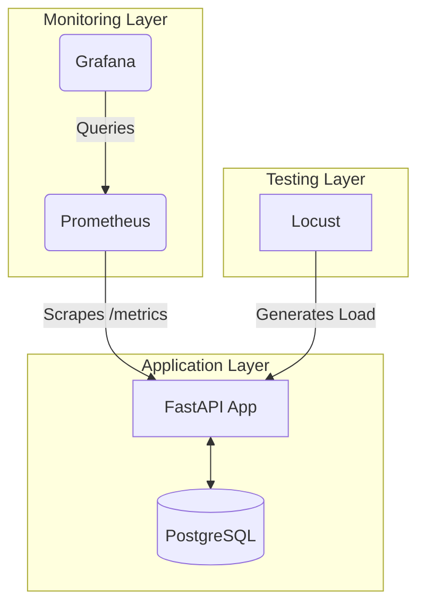
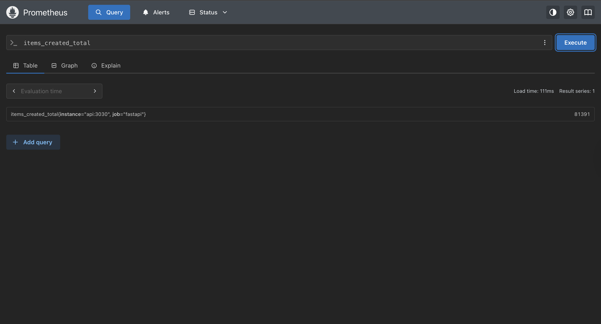

 # FastAPI Monitoring & Observability Practice


## 📖 Overview

This project is a practical implementation of monitoring and observability patterns for a FastAPI application. It was developed as part of a training brief to master **Prometheus** instrumentation, **Grafana** visualization, and **Locust** stress testing.

The repository contains a fully instrumented CRUD API, a complete Dockerized monitoring stack, and documentation of the troubleshooting steps taken to ensure system stability under load.

---

## 🏗️ Architecture

The solution follows a standard observability stack where Prometheus pulls metrics from the application, and Grafana provides the visualization layer.



---

## 🚀 Getting Started

### Prerequisites
- [Docker & Docker Compose](https://docs.docker.com/get-docker/)
- [uv](https://github.com/astral-sh/uv) (Python package manager)

### Installation & Setup

1. **Clone the repository** and navigate to the project root.
2. **Install dependencies** using `uv`:
   ```bash
   uv sync
   ```
3. **Configure environment**:
   Copy the example environment file and adjust if necessary:
   ```bash
   cp .env.example .env
   ```
4. **Launch the stack**:
   ```bash
   docker compose up -d
   ```

### Accessing the Services

| Service | URL | Credentials |
|---------|-----|-------------|
| **FastAPI API** | [http://localhost:3030](http://localhost:3030) | - |
| **API Metrics** | [http://localhost:3030/metrics](http://localhost:3030/metrics) | - |
| **Prometheus** | [http://localhost:9090](http://localhost:9090) | - |
| **Grafana** | [http://localhost:4040](http://localhost:4040) | `admin` / `admin` |

---

## 🛠️ Implementation Details

### 1. Instrumentation
The API is instrumented using `prometheus_client` and `prometheus-fastapi-instrumentator`. It exposes:
- **Standard HTTP metrics**: Request count, latency, in-progress requests.
- **Custom Business metrics**: CRUD operation counters (e.g., `items_created_total`).
- **Database metrics**: Query duration histograms and connection pool status.

### 2. Observability Concepts
Detailed research on PromQL and observability pillars was conducted during the project.
- **Mission 1**: Understanding `rate()` vs `increase()`, label filtering, and `histogram_quantile()`.
- **Mission 2**: Prometheus naming best practices and dashboard design.
- 📖 See [OBSERVABILITY_WATCH.md](docs/OBSERVABILITY_WATCH.md) for the full research notes.

---

## 🔧 Troubleshooting & Resolutions

During development, two critical issues were identified and resolved:

### 1. Startup & Connectivity Failure
- **Issue**: The API container failed to start due to missing packages and was unreachable by Prometheus.
- **Resolution**: Synchronized dependencies using `uv sync` and corrected the Uvicorn binding to `0.0.0.0:3030` to allow cross-container communication.

### 2. Database Driver & Load Instability
- **Issue**: `psycopg2` incompatibility with Python 3.14 caused crashes, and high-volume stress tests overwhelmed the endpoint.
- **Resolution**: Upgraded the database driver to `psycopg` (v3) and optimized the `DATABASE_URL`. Stress test parameters were adjusted to find a sustainable "safe volume" for the single-node environment.

---

## 📊 Verification & Results

The following results were obtained during the final verification phase.

### Prometheus & Metrics Verification
- **Target Status**: Prometheus successfully scrapes the API.
  <figure>
    
    <figcaption><i>Prometheus Targets page showing the 'fastapi' service as UP.</i></figcaption>
  </figure>

- **Metrics Exposure**: Raw data available at the `/metrics` endpoint.
  <figure>
    
    <figcaption><i>Instrumented metrics being exported in Prometheus format.</i></figcaption>
  </figure>

- **Querying Data**: Custom metrics like `items_created_total` are searchable.
  <figure>
    
  </figure>

### Stress Testing Observations (Locust)
We performed three levels of testing to identify the system's limits:

1. **Light Load (50 Users)**: Stable RPS, low P95 latency. Baseline performance is healthy.
   <figure></figure>

2. **Medium Load (100 Users)**: Increased latency and occasional error spikes. Resource contention begins to appear.
   <figure></figure>

3. **Heavy Load (1000 Users)**: System saturation. High error rates and timeouts observed.
   <figure></figure>

---

## 📂 Repository Structure

- `app/`: FastAPI application source code.
- `docs/`: Project brief and observability research.
- `prometheus/`: Prometheus configuration and alerting rules.
- `screenshots/`: Visual evidence of test results and dashboards.
- `docker-compose.yml`: Full stack orchestration.

---

*Project maintained for learning purposes. Not intended for production use without further hardening.*

