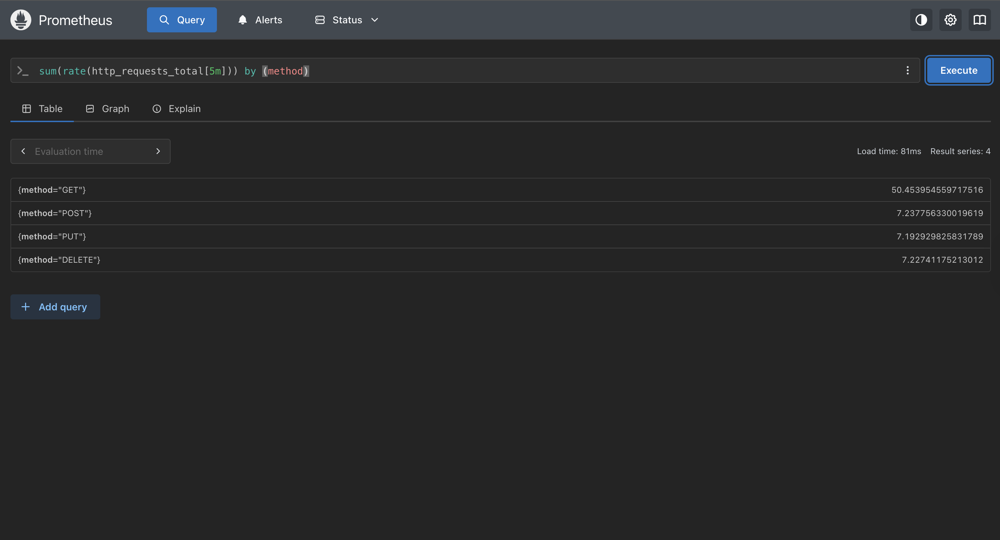
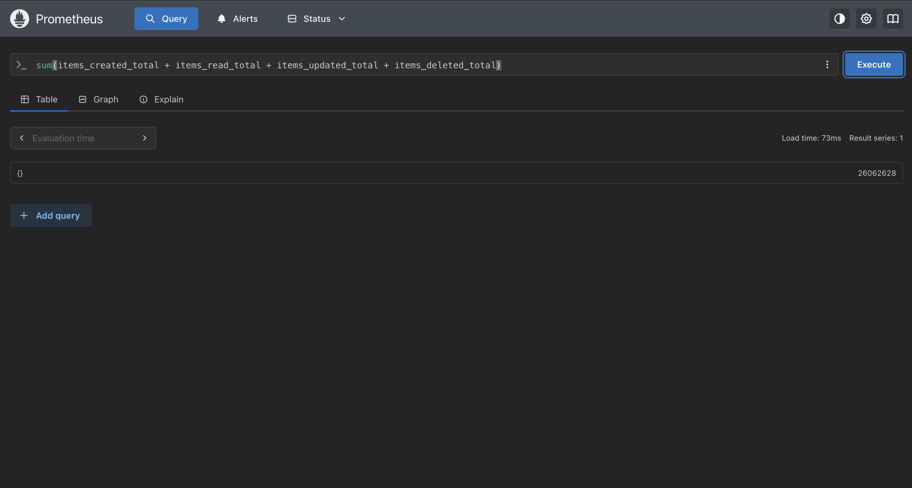

 # FastAPI Observability

 
 
 

 Short project used to practice instrumentation, Prometheus scraping, Grafana dashboards and lightweight stress testing with Locust. This repository contains the code and configuration used during the exercise — only the items actually implemented are documented here.

 **Scope implemented**
 - Instrumented FastAPI app exposing `/metrics` using `prometheus_client` and `prometheus-fastapi-instrumentator`.
 - Docker Compose stack including: the FastAPI app (`api`), PostgreSQL (`db`), Prometheus and Grafana.
 - Fixed runtime issues that prevented the API from starting (missing packages and service port binding).
 - Upgraded database driver to `psycopg` (psycopg v3) for Python 3.14 compatibility.
 - Basic stress testing with `locust` and adjustments to stress volume to avoid overloading the endpoint during tests.

 Why this project exists: learning and practising observability patterns (metrics, scraping, dashboards) and how to verify through load tests.

 **Repository layout (relevant parts)**

 - `app/` — FastAPI app, database config and routes.
 - `docs/` — Brief and watch notes about PromQL and observability used for the exercise.
 - `prometheus/` — Prometheus configuration used to scrape the API.
 - `screenshots/` — Verification screenshots (check `screenshots/` for examples of dashboards and test results).
 - `docker-compose.yml` — Local compose stack used for testing and verification.

 **Quick architecture**

 ```mermaid
 flowchart LR
   A[FastAPI app] -->|HTTP /metrics| B(Prometheus)
   A -->|Reads/Writes| C[(Postgres DB)]
   B --> D[Grafana]
   E[Locust] -->|Load| A
 ```

 ---

 ## How the issues were resolved (concise)

 1. First startup failure: missing packages & wrong binding

 - Cause: Some required packages were not installed in the environment and the app/uvicorn process was not binding to the expected interface/port inside its container.
 - Fix applied: Installed missing dependencies (via `uv sync`) and ensured the server binds to `0.0.0.0:3030` so Docker and Prometheus can reach it.

 2. Scraping / connection errors during stress tests

 - Cause: psycopg2 incompatibility with Python 3.14 caused the app to crash in some environments; in other cases, under heavy locust load the endpoint became unresponsive.
 - Fix applied: Upgraded to `psycopg` (psycopg v3) and reduced stress volume (fewer concurrent users / slower spawn rate) to keep the endpoint responsive during verification.

 ---

 ## Reproduce (minimal)

 1. Install project dependencies (this project uses `uv` to manage dependencies):

 ```bash
 # in project root
 uv sync
 ```

 2. Start the stack (Docker Compose):

 ```bash
 docker compose up -d
 ```

 3. Verify endpoints:

 ```bash
 # API metrics
 curl http://localhost:3030/metrics

 # Prometheus UI
 open http://localhost:9090/targets

 # Grafana UI
 open http://localhost:4040
 ```

 Notes:
 - If you run heavy load tests, reduce `--users` and `--spawn-rate` for `locust` to avoid overwhelming the single-node test environment. Example used for verification: `locust -f locustfile.py --host http://localhost:3030 --users 50 --spawn-rate 5`.

 ---

 ## Files of interest

 - `app/database.py` — contains `DATABASE_URL` (uses `postgresql+psycopg://...` after the upgrade).
 - `pyproject.toml` — project deps, updated to use `psycopg>=3.1.0`.
 - `docker-compose.yml` — compose stack used in tests.
 - `prometheus/prometheus.yml` — scrape configuration for the API.

## Verification & Results (embedded screenshots & observations)

Below are the verification images, embedded inline as thumbnails for quick inspection. Click any thumbnail to open the full-size image in the `screenshots/` folder.

### Prometheus & metrics

- **Prometheus target: `fastapi` UP** (`prometheus fastapi up.png`) — verifies Prometheus scrapes the API `/metrics` endpoint.

<figure>
  
  <figcaption><strong>Prometheus target UP</strong> — Prometheus targets page showing `fastapi` as UP (Phase 2).</figcaption>
</figure>

- **Raw `/metrics` output** (`metrics endpoint.png`) — shows the instrumented metrics exported by the app (counters, histograms, gauges). Useful when checking the app is properly exposing data for PromQL queries (Mission 1).

<figure>
  
  <figcaption><strong>Metrics endpoint</strong> — Raw endpoint content used to validate metrics are exported.</figcaption>
</figure>

- **Metric presence example: `items_created_total`** (`items_created_total.png`) — confirms a custom metric is being recorded and available for queries such as `rate(items_created_total[5m])`.

<figure>
  
  <figcaption><strong>items_created_total</strong> — Example counter visible in Prometheus.</figcaption>
</figure>

- **Label filtering example** (`http_request_total_by_method.png`) — demonstrates grouping and filtering by label (e.g., `sum(rate(http_requests_total[5m])) by (method)`).

<figure>
  
  <figcaption><strong>HTTP requests by method</strong> — Label-based aggregation example.</figcaption>
</figure>

- **CRUD counters and aggregations** (`all_CRUD_operations.png`) — used for dashboards that display business metrics (Phase 3 dashboards) and to validate aggregation queries described in Mission 2.

<figure>
  
  <figcaption><strong>CRUD operations</strong> — Aggregated business counters used in dashboards.</figcaption>
</figure>

---

### Troubleshooting evidence (errors that were fixed)

- **API startup error (missing packages / binding issue)** (`api error 1.png`) — captured the first failure where the app did not start due to missing deps / wrong bind address; fixed by installing missing packages (`uv sync`) and ensuring uvicorn binds to `0.0.0.0:3030`.

<figure>
  
  <figcaption><strong>API error 1</strong> — Startup failure before fixes.</figcaption>
</figure>

- **Driver compatibility error (psycopg2)** (`api error 2.png`) — showed the compatibility error that motivated switching to `psycopg` (psycopg v3). After upgrading dependencies, the API started reliably under normal conditions.

<figure>
  
  <figcaption><strong>API error 2</strong> — Driver compatibility error (fixed by upgrade).</figcaption>
</figure>

---

### Stress tests (Locust) — observations and conclusions

These screenshots show three stress-test profiles used to validate behaviour under increasing load. Observations summarize what was seen in each test and inform the recommended Locust parameters in `.env.example`.

- **Light test — 50 users, spawn rate 10** (`users 50 spawn rate 10.png`) — Observation: stable RPS, low P95 latency and no notable error spikes. This profile is a good baseline for functionality checks.

<figure>
  
  <figcaption><strong>Light test — 50 users</strong> — Stable RPS and low P95 latency.</figcaption>
</figure>

- **Medium test — 100 users, spawn rate 10** (`users 100 spawn rate 10.png`) — Observation: increased latency and occasional error spikes under sustained load; useful to identify early contention points (DB latency, request queueing).

<figure>
  
  <figcaption><strong>Medium test — 100 users</strong> — Increased latency and occasional error spikes.</figcaption>
</figure>

- **Heavy test — 1000 users, spawn rate 20** (`users 1000 spawn rate 20.png`) — Observation: system becomes overwhelmed, high error rate and timeouts observed. This test motivated reducing stress volume in verification runs to avoid crashing the single-node test environment.

<figure>
  
  <figcaption><strong>Heavy test — 1000 users</strong> — High error rate and timeouts.</figcaption>
</figure>

**Summary of how these results answer the brief**

- <strong>Mission 1 (PromQL)</strong> — `metrics endpoint` and `items_created_total` provide raw metrics to practise `rate()` and `increase()`; `http_request_total_by_method` shows label filtering.
- <strong>Mission 2 (Dashboards)</strong> — `all_CRUD_operations` demonstrates dashboard-ready aggregations and metric naming for Phase 3 panels.
- <strong>Phase 4 (Stress Testing)</strong> — The Locust tests demonstrate baseline → contention → overload and were used to set safe test limits.

> For background on the PromQL functions and label matchers used to build these queries, see `docs/OBSERVABILITY_WATCH.md` (Mission 1 & 2 theories and examples).
> Note: For PromQL examples and conceptual answers used during the exercises, see `docs/OBSERVABILITY_WATCH.md` (Mission 1 & 2 explanations). The watch file explains `rate()` vs `increase()`, label matching, and `histogram_quantile()` which were used to build the dashboard panels and queries above.

---

 Project maintained for learning purposes — not intended as production-grade monitoring scaffolding. Use as a starting point for instrumenting FastAPI apps and practising Prometheus + Grafana workflows.

